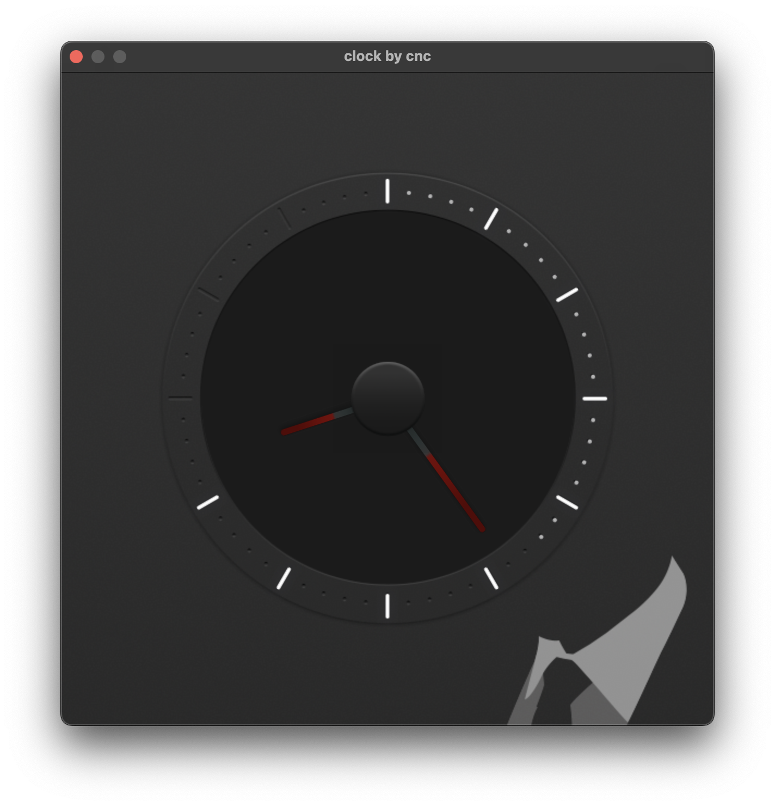

## Analog clock app for MacOS

This small projects builds an analog clock featuring the following concepts:

- creating a window
- creating an application object
- drawing with a constant frame rate
- creating a hardware renderer using the Metal framework
- loading images (PNG files)
- texture mapping
- 2D projection
- 2D rotation
- separation between platform layer and application

## What you need

All you need to follow along or just build this project is:

- Visual Studio Code
- XCode command line tools (not XCode itself)

# How to build and run

In order to build the project execute <br>
```sh build.sh``` <br>
in the root directory of this project

In order to run execute <br>
```./clock```
